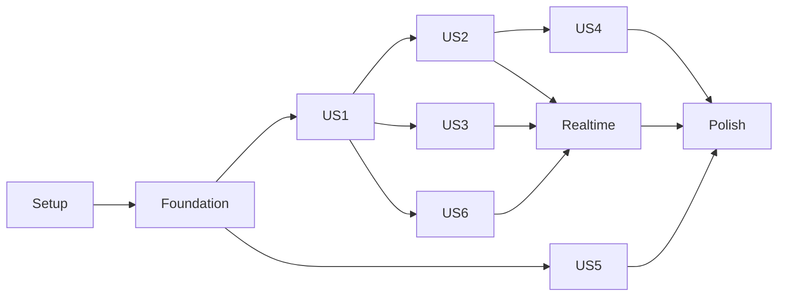

# Tasks: Production Flow

**Feature**: Production Flow  
**Status**: Ready  
**Created**: 2026-09-09

## Phase 1: Setup

**Goal**: estabelecer o monorepo, ferramentas e infraestrutura local.

- [ ] T001 Criar workspaces pnpm e scripts raiz em `package.json` e `pnpm-workspace.yaml`
- [ ] T002 [P] Inicializar React 19, Vite e TypeScript em `apps/web/`
- [ ] T003 [P] Inicializar Fastify e TypeScript em `services/api/`
- [ ] T004 [P] Criar pacotes compartilhados em `packages/ui/`, `packages/types/` e `packages/shared/`
- [ ] T005 Configurar lint, formatação e TypeScript estrito em `eslint.config.js`, `prettier.config.js` e `tsconfig.base.json`
- [ ] T006 [P] Configurar Vitest e React Testing Library em `apps/web/vitest.config.ts`
- [ ] T007 [P] Configurar testes de integração em `services/api/vitest.config.ts`
- [ ] T008 [P] Configurar Playwright e axe em `playwright.config.ts` e `tests/e2e/`
- [ ] T009 Instalar e configurar `@govbr-ds/core` em `apps/web/src/styles/dsgov.css`
- [ ] T010 Documentar variáveis locais em `.env.example`

---

## Phase 2: Foundational

**Goal**: concluir dados, autenticação e autorização que bloqueiam todas as histórias.

**Independent Test**: migrations e seed executam; usuário autenticado recebe perfil; chamadas sem sessão retornam 401 e chamadas sem permissão retornam 403.

- [ ] T011 Definir User, Role, Area, UserArea, Production, ProductionMember, Objective com `sceneReference` e `stageReference` opcionais, ObjectiveSharedArea, Document, Comment e HistoryEntry em `prisma/schema.prisma`
- [ ] T012 Criar migração inicial e restrições de compartilhamento em `prisma/migrations/`
- [ ] T013 Criar seed de papéis e áreas audiovisuais em `prisma/seed.ts`
- [ ] T014 [P] Definir schemas Zod e tipos públicos, incluindo cena e etapa opcionais do objetivo, em `packages/types/src/`
- [ ] T015 Implementar Google OAuth/OIDC e sessão segura em `services/api/src/modules/auth/`
- [ ] T016 Implementar `GET /me` e `PUT /me/profile` em `services/api/src/modules/auth/routes.ts`
- [ ] T017 Implementar middleware de produção e sessão em `services/api/src/plugins/auth.ts`
- [ ] T018 Implementar políticas `canReadObjective`, `canWriteOperationalFields` e `canWriteStructuralFields` em `services/api/src/modules/objectives/policies.ts`
- [ ] T019 [P] Testar 401, 403 e matriz de papéis em `services/api/tests/authorization.test.ts`
- [ ] T020 Configurar Prisma e transações de histórico em `services/api/src/plugins/prisma.ts`

**Checkpoint**: infraestrutura pronta; histórias podem ser implementadas incrementalmente.

---

## Phase 3: User Story 1 — Centralizar a produção (P1)

**Goal**: entregar a aba Objetivos com Kanban por área e detalhe contextual.

**Independent Test**: um usuário autenticado abre Objetivos, vê todas as colunas estruturais, somente cards autorizados, filtra por cena ou etapa e abre um objetivo sem sair do fluxo.

- [ ] T021 [P] [US1] Testar consulta autorizada, filtros de cena/etapa e colunas vazias em `services/api/tests/objectives-list.test.ts`
- [ ] T022 [P] [US1] Testar tabs, Kanban e modal por teclado em `apps/web/src/features/dashboard/dashboard.test.tsx`
- [ ] T023 [US1] Implementar consulta autorizada com filtros opcionais de cena e etapa em `services/api/src/modules/objectives/repository.ts`
- [ ] T024 [US1] Implementar `GET /productions/:productionId/areas` e `GET /productions/:productionId/objectives?scene=&stage=` em `services/api/src/modules/objectives/routes.ts`
- [ ] T025 [P] [US1] Criar shell, cabeçalho e tabs DSGOV em `apps/web/src/features/dashboard/DashboardPage.tsx`
- [ ] T026 [P] [US1] Criar componentes `AreaColumn`, `ObjectiveCard`, `ObjectiveFilters` e `EmptyAreaState`, exibindo cena/etapa quando presentes, em `apps/web/src/features/objectives/components/`
- [ ] T027 [US1] Integrar Kanban horizontal com TanStack Query em `apps/web/src/features/objectives/ObjectivesBoard.tsx`
- [ ] T028 [US1] Criar modal acessível de detalhe com contexto de cena e etapa em `apps/web/src/features/objectives/ObjectiveDetailDialog.tsx`
- [ ] T029 [US1] Aplicar responsividade e scroll horizontal em `apps/web/src/features/objectives/objectives.css`

---

## Phase 4: User Story 2 — Checklist e status (P1)

**Goal**: permitir mudanças entre pendente, em andamento e concluído e recalcular progresso agregado.

**Independent Test**: usuário autorizado altera status; card muda por texto e visual; progresso da área muda por concluídos/total; card não mostra percentual individual.

- [ ] T030 [P] [US2] Testar transições e histórico em `services/api/tests/objective-status.test.ts`
- [ ] T031 [P] [US2] Testar cálculo com total zero e escopo autorizado em `services/api/tests/progress.test.ts`
- [ ] T032 [US2] Implementar serviço de transição dos três status em `services/api/src/modules/objectives/status-service.ts`
- [ ] T033 [US2] Implementar agregação de progresso por área e produção em `services/api/src/modules/objectives/summary-service.ts`
- [ ] T034 [US2] Implementar `PATCH /objectives/:objectiveId/status` em `services/api/src/modules/objectives/routes.ts`
- [ ] T035 [US2] Criar controles e tags acessíveis de status em `apps/web/src/features/objectives/ObjectiveStatusControls.tsx`
- [ ] T036 [US2] Remover percentual individual e barra de card em `apps/web/src/features/objectives/ObjectiveCard.tsx`

---

## Phase 5: User Story 3 — Colaboração entre áreas (P1)

**Goal**: expor objetivos compartilhados por área com permissão operacional e contexto preservado.

**Independent Test**: membro vê objetivo de outra área somente quando compartilhado com sua área, identifica o selo e consegue comentar/alterar status sem editar campos estruturais.

- [ ] T037 [P] [US3] Testar compartilhamento por área, deduplicação e negativas 403 em `services/api/tests/objective-sharing.test.ts`
- [ ] T038 [P] [US3] Testar selo compartilhado e ausência de edição estrutural em `apps/web/src/features/objectives/objective-sharing.test.tsx`
- [ ] T039 [US3] Implementar persistência e validação de `ObjectiveSharedArea` em `services/api/src/modules/objectives/sharing-service.ts`
- [ ] T040 [US3] Implementar indicador `Compartilhado com sua área` em `apps/web/src/features/objectives/SharedObjectiveTag.tsx`
- [ ] T041 [US3] Implementar comentários append-only em `services/api/src/modules/comments/routes.ts`
- [ ] T042 [US3] Criar formulário e histórico de comentários em `apps/web/src/features/objectives/ObjectiveComments.tsx`
- [ ] T043 [US3] Registrar comentário e mudança de status em `services/api/src/modules/history/history-service.ts`

---

## Phase 6: User Story 4 — Supervisão e criação (P2)

**Goal**: oferecer Resumo global e criação/edição estrutural somente para Diretor/AD.

**Independent Test**: Diretor/AD vê métricas globais e cria objetivo em qualquer área; membro recebe 403 ao tentar a mesma chamada e vê apenas métricas autorizadas.

- [ ] T044 [P] [US4] Testar criação válida, cena/etapa opcionais, campos obrigatórios e responsável elegível em `services/api/tests/objective-create.test.ts`
- [ ] T045 [P] [US4] Testar agregados globais versus escopados em `services/api/tests/summary-authorization.test.ts`
- [ ] T046 [US4] Implementar criação e edição estrutural transacional, incluindo cena e etapa opcionais, em `services/api/src/modules/objectives/objective-service.ts`
- [ ] T047 [US4] Implementar `POST /productions/:productionId/objectives` e `PATCH /objectives/:objectiveId` em `services/api/src/modules/objectives/routes.ts`
- [ ] T048 [US4] Implementar `GET /productions/:productionId/summary` com escopo no backend em `services/api/src/modules/objectives/summary-routes.ts`
- [ ] T049 [P] [US4] Criar aba Resumo com indicadores e progresso por área em `apps/web/src/features/summary/SummaryTab.tsx`
- [ ] T050 [P] [US4] Criar modal de objetivo com cena e etapa opcionais e responsável em combobox em `apps/web/src/features/objectives/CreateObjectiveDialog.tsx`
- [ ] T051 [US4] Exibir ação Novo objetivo somente para supervisor em `apps/web/src/features/objectives/ObjectivesToolbar.tsx`
- [ ] T052 [US4] Testar criação por supervisor e bloqueio de membro em `tests/e2e/supervision.spec.ts`

---

## Phase 7: User Story 5 — Login, perfil e contexto (P2)

**Goal**: concluir login, onboarding e experiência por papel/área.

**Independent Test**: primeiro login exige perfil; usuário multiárea vê união sem duplicidade; troca de sessão não preserva conteúdo sem acesso.

- [ ] T053 [P] [US5] Testar onboarding e perfil incompleto em `services/api/tests/profile.test.ts`
- [ ] T054 [P] [US5] Testar união multiárea sem duplicidade em `services/api/tests/multi-area-visibility.test.ts`
- [ ] T055 [US5] Criar rotas protegidas e carregamento da sessão em `apps/web/src/app/router.tsx`
- [ ] T056 [US5] Criar login Google e tratamento de sessão expirada em `apps/web/src/features/auth/`
- [ ] T057 [US5] Criar onboarding de nome, papel e áreas em `apps/web/src/features/profile/ProfileOnboarding.tsx`
- [ ] T058 [US5] Limpar caches e fechar diálogos ao mudar a identidade autenticada em `apps/web/src/app/session.ts`

---

## Phase 8: User Story 6 — Documentos e materiais (P3)

**Goal**: manter links e materiais dentro do contexto do objetivo visível.

**Independent Test**: usuário autorizado adiciona e abre um material; objetivo visível sempre mostra seus documentos; falha de URL apresenta mensagem amigável.

- [ ] T059 [P] [US6] Testar autorização e histórico de documentos em `services/api/tests/documents.test.ts`
- [ ] T060 [US6] Implementar serviço e rotas de documentos em `services/api/src/modules/documents/`
- [ ] T061 [US6] Criar lista e formulário de materiais em `apps/web/src/features/objectives/ObjectiveDocuments.tsx`
- [ ] T062 [US6] Implementar estado de recurso indisponível em `apps/web/src/features/objectives/DocumentLink.tsx`

---

## Phase 9: Realtime, Offline and Autosave

**Goal**: atender colaboração simultânea e tratamento de falhas transversalmente.

- [ ] T063 Configurar autenticação e salas Socket.IO em `services/api/src/modules/realtime/socket.ts`
- [ ] T064 [P] Publicar eventos de status em `services/api/src/modules/objectives/status-service.ts`
- [ ] T065 [P] Publicar eventos de comentários e documentos em `services/api/src/modules/comments/` e `services/api/src/modules/documents/`
- [ ] T066 Implementar presença efêmera por objetivo em `services/api/src/modules/realtime/presence.ts`
- [ ] T067 Implementar cliente realtime e reconexão em `apps/web/src/lib/realtime.ts`
- [ ] T068 Implementar indicadores de usuários ativos em `apps/web/src/features/objectives/ObjectivePresence.tsx`
- [ ] T069 Implementar auto-save e last write wins com versão em `apps/web/src/features/objectives/useObjectiveAutosave.ts`
- [ ] T070 Implementar banners offline e falha de sincronização em `apps/web/src/app/ConnectivityStatus.tsx`
- [ ] T071 Testar eventos, concorrência e preservação de dados em `services/api/tests/realtime.test.ts`

---

## Phase 10: Polish and Cross-Cutting Quality

- [ ] T072 Revisar componentes e tokens DSGOV em `apps/web/src/`
- [ ] T073 Validar teclado, foco de modais, tabs e nomes acessíveis em `tests/e2e/accessibility.spec.ts`
- [ ] T074 Validar contraste WCAG AA/eMAG com axe em `tests/e2e/accessibility.spec.ts`
- [ ] T075 Validar desktop, tablet e mobile sem sobreposição em `tests/e2e/responsive.spec.ts`
- [ ] T076 Validar fluxo completo por papel em `tests/e2e/production-flow.spec.ts`
- [ ] T077 Executar auditoria de autorização para todos os endpoints em `services/api/tests/authorization-matrix.test.ts`
- [ ] T078 Atualizar evidências e comandos de execução em `specs/001-production-flow/quickstart.md`

## Dependencies

- Phase 1 → Phase 2 → histórias de usuário.
- US1 é o primeiro incremento navegável.
- US2 depende da consulta e dos cards de US1.
- US3 depende de US1 e das políticas da Phase 2; pode avançar em paralelo com US2 após isso.
- US4 depende do modelo de objetivo e agregações de US2; UI pode avançar em paralelo aos endpoints.
- US5 depende da autenticação foundational e pode avançar em paralelo a US2/US3.
- US6 depende de autorização e detalhe de US1.
- Realtime depende de status, comentários e documentos implementados.
- Polish depende de todas as histórias incluídas no release.

## Parallel Execution Examples

- Após Phase 2, T021 e T022 podem executar em paralelo; T025 e T026 também.
- Em US3, testes de API e componente (T037/T038) podem ser preparados em paralelo.
- Em US4, Summary e Create Dialog (T049/T050) podem avançar em paralelo aos endpoints após contratos estáveis.
- Em US5, testes de perfil e multiárea (T053/T054) podem executar em paralelo.
- Em realtime, publicação de status e publicação de comentário/documento (T064/T065) podem executar em paralelo.

## Implementation Strategy

1. **MVP navegável**: Phase 1 + Phase 2 + US1.
2. **Operação diária**: adicionar US2 e US3.
3. **Liderança e identidade**: adicionar US4 e US5.
4. **Contexto completo**: adicionar US6.
5. **Colaboração simultânea e release**: realtime + polish.

Cada história deve encerrar com seu teste independente passando antes da próxima integração.